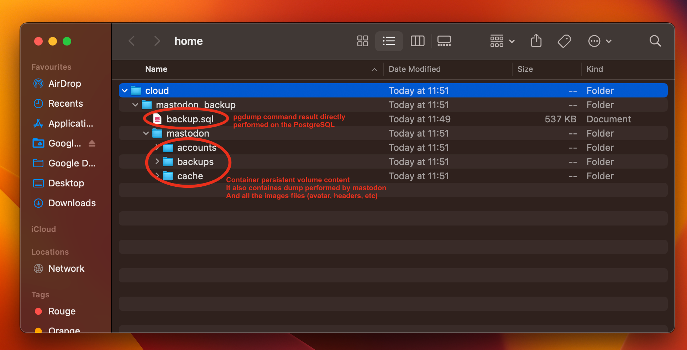

# Mastodon ansible role

This is an ansible role for installing mastodon on comwork cloud.

We got our own instance here: https://mastodon.comwork.io

## Table of content

[[_TOC_]]

## Git repositories

* Main repo: https://gitlab.comwork.io/oss/ansible-iac/mastodon.git
* Github mirror: https://github.com/idrissneumann/ansible-mastodon.git
* Gitlab mirror: https://gitlab.com/ineumann/ansible-mastodon.git
* Froggit mirror: https://lab.frogg.it/ineumann/ansible-mastodon.git

## Requirements

### Using comwork cloud

Install PostgreSQL [this tutorial](https://doc.cloud.comwork.io/docs/tutorials/dbaas).

### All by yourself

If you do not want to use comworker, you have to install those requirements by yourself (using appropriate ansible roles for example):
* PostgreSQL
* Nginx for the reverse proxy
* Letsencrypt / certbot
* docker
* docker-compose

Configure the reverse proxy to expose the port `3000`.

## Init mastodon

Add this role to your infra git repo and add it in the playbook.

The settings to change are [here](./defaults/main.yml). You have to replace all the value containing `changeit` except those three you'll change after the first deployments:

```yaml
mastodon_secret_key: changeit
mastodon_vapid_private_key: changeit
mastodon_vapid_public_key: changeit
```

Beware on setting the `mastodon_public_path` and `backup_folder` variables using the home folder of an existing user on your host.

Run a first deployment (push on your gitops repo), then run this command on the server:

```shell
docker-compose -f docker-compose-mastodon.yml run --rm shell bundle exec rake secret
```

Replace the `mastodon_secret_key` variable with the returned value.

Then:

```shell
docker-compose -f docker-compose-mastodon.yml run --rm shell bundle exec rake mastodon:webpush:generate_vapid_key
```

Replace the `mastodon_vapid_private_key` and `mastodon_vapid_public_key` with the returned values.

Then, run the database migrations:

```shell
docker-compose -f docker-compose-mastodon.yml run --rm shell bundle exec rake db:migrate
```

## Set a user as an admin

Run this command on the server:

```shell
USERNAME="your_username"
docker-compose -f docker-compose-mastodon.yml run -e USERNAME=${USERNAME} --rm shell bundle exec rake comwork:set_admin
```

## Backup your instance

Use [bucket-backup](https://gitlab.comwork.io/oss/bucket-backup), you can refer to the [previous tutorial](https://doc.cloud.comwork.io/docs/tutorials/dbaas) in order to add this role.

Here's the settings you need to set:

```yaml
bucket_endpoint: "https://changeit"
bucket_access_key: changeit
bucket_secret_key: changeit
bucket_name: mastodon-backup
backup_cmd: "/root/mastodon-backup.sh" # this has been generated by this matomo role
zip_compress_backup_enable: true
backup_folder: /home/cloud/mastodon_backup
backup_zip_file_folder: /home/backups/tmp
backup_max_retention: 3
```

Here's what you'll find in a backup archive:


